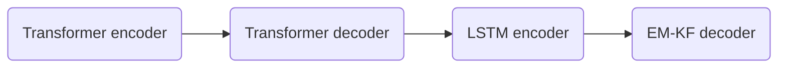
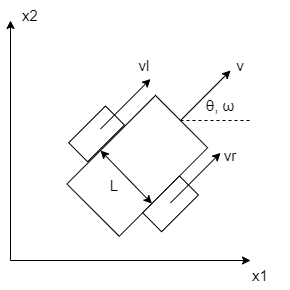

# Notes

## LQG optimal control

Linear quadratic Gaussian (LQG) optimal control consists of linear quadratic regulator (LQR) feedback control, and Kalman filter (KF) state observer for stochastic linear system. Consider a stochastic linear system 

$$\dot x=Ax+Bu+e_x,$$ 

$$y=Cx+Du+e_y,$$ 

where ex and ey are white noises following

$$e_x\sim N(0,Q),e_y\sim N(0,R),x(0)\sim N(x_0,P_0).$$ 

Linear quadratic regulator (LQR) designs a feedback control $u=-Kx$, minimizing

$$J=\int_0^{t_f}(x^TQx+u^TRu)dt+x_f^TFx_f,$$ 

where $x_f=x(t_f)$. Feedback matrix is computed by
$$K=R^{-1}B^T P,$$ 

where P is the solution of Riccati equation

$$\dot P=-PA-A^{T} P + PBR^{-1} B^{T} P - Q.$$ 

For a time-invariant system that $\dot P=0$, hence

$$-PA-A^{T} P + PBR^{-1} B^{T} P - Q=0,$$ 

$$\dot x=(A-BK)x=(A-BR^{-1}B^T P)x,$$ 

$$J=\frac{1}{2} x_0^T Px_0.$$

In LQR controller, P can be solved by iteration from $P(t_f)=F$ or $P(0)=P_0$. When $\dot P=0$, P can be solved by least square method, Hamilton matrix method, dynamic programming (DP), linear matrix inequality (LMI), etc. Based on this LQR system, Kalman filter requires observation y to obtain optimal estimation of state x from noised data. Let T denotes time step, the discretization of linear system is

$$x(k+1)=(I+AT)x(k)+TBu(k)+Te_x(k).$$

Then, Kalman filter is performed iteratively by maximizing $p(x(k+1)|y(k),x(k))$.

## Proposed algorithm

Inspired by our previous work [Incorporating Transformer and LSTM to Kalman Filter with EM algorithm for state estimation](https://arxiv.org/abs/2105.00250) (Fig. 1), this repository combines deep learning models, Transformer and LSTM, for KF in LQG. 

Fig.1 Deep learning-based KF

EM-KF adopts expectation maximization (EM) algorithm for parameters estimation before Kalman filtering. This repository utilizes EM-KF to estimate the feedback matrix of LQR controller, instead of classical Ricatti equation-based LQR.
- Classical method: $\dot x=\hat Ax,\hat A=A-BK=A-BR^{-1}B^T P$, P is the solution of Riccati equation.
- Our method: $\dot x=\hat Ax$. $\hat A$ is solved by EM algorithm-based iteration from initial $\hat A_0=A-BR^{-1}B^T P_0$.

## AGV system

### Example1 Acceration-driven system

Consider an AGV system that position x can be observed, and is driven by acceration u.

$$\begin{pmatrix}
        \dot x\\ \ddot x
    \end{pmatrix}=\begin{pmatrix}
        0 & 1 \\0 & 0
    \end{pmatrix}\begin{pmatrix}
        x\\\dot x
    \end{pmatrix}+\begin{pmatrix}
        0\\1
    \end{pmatrix}u,$$

$$y=\begin{pmatrix}
        1 & 0
    \end{pmatrix}\begin{pmatrix}
        x\\\dot x
    \end{pmatrix}.$$

### Example2 Temperature control system

In indutrial applications, The operation of AGV for biochemical usage usually depends on the stability of environmental factors (e.g. temperature). The transfer function of temperature control system is simulated by

$$G(s)=\frac{Y(s)}{U(s)}=\frac{K\exp(-\tau s)}{Ts+1}\approx \frac{K}{(Ts+1)(\tau s+1)},$$

where y is temperature, u is the control signal. Commonly, u is the output of a PID controller requiring error value as input. Let $a=1/(T\tau)$, then the state-space model of G(s) is

$$\begin{pmatrix}
        \dot x\\ \ddot x
    \end{pmatrix}=\begin{pmatrix}
        0 & 1 \\-a & -a(T+\tau)
    \end{pmatrix}\begin{pmatrix}
        x\\\dot x
    \end{pmatrix}+\begin{pmatrix}
        0\\1
    \end{pmatrix}u,$$

$$y=\begin{pmatrix}
        aK & 0
    \end{pmatrix}\begin{pmatrix}
        x\\\dot x
    \end{pmatrix}.$$

### Two-wheel differential AGV in cartesian coordinate

An AGV on 2D-plane requires linear velocity v and angular velocity $\omega$ to control the position $(x_1,x_2,\theta)^T$ in cartesian coordinate (Fig. 2). 

Fig.2 Two-wheel differential AGV

The kinematics equations are

$$\dot x_1=v\cos\theta, \dot x_2=v\sin\theta, \dot\theta=\omega.$$

Let vl and vr denote the linear velocity of left or right wheel, respectively, and L denotes the width of the vehicle, then

$$v_l=v+\frac{\omega L}{2},v_r=v-\frac{\omega L}{2}.$$

Hence, linear velocity v can be set as constant to decouple v and $\theta$. Only $\omega$ is the control signal for manipulating left or right wheel. Let $(x_{10},x_{20},\theta_0)^T$ denotes the initial position, using $\cos\theta\approx 1,\sin\theta\approx\theta$, the system can be linearized as

$$\begin{pmatrix}
        \dot x_1 \\ \dot x_2 \\ \dot\theta
    \end{pmatrix}=\begin{pmatrix}
        0 & 0 & 0\\0 & 0 & v\\0& 0& 0
    \end{pmatrix}\begin{pmatrix}
        x_1 \\ x_2 \\ \theta
    \end{pmatrix}+\begin{pmatrix}
        0\\0 \\ 1
    \end{pmatrix}\omega+\begin{pmatrix}
        1\\0\\0
    \end{pmatrix}v.$$

Using Taylor expansion

$$y=\sqrt{x_1^2+x_2^2}=\sqrt{x_{10}^2+x_{20}^2}+\frac{x_{10}}{\sqrt{x_{10}^2+x_{20}^2}} (x_1-x_{10})+\frac{x_{20}}{\sqrt{x_{10}^2+x_{20}^2}}(x_2-x_{20}).$$

Using 

$$\cos\theta_0=\frac{x_{10}}{\sqrt{x_{10}^2+x_{20}^2}},\sin\theta_0=\frac{x_{20}}{\sqrt{x_{10}^2+x_{20}^2}},$$

Hence

$$y=\begin{pmatrix}\cos\theta_0 & \sin\theta_0 &0\end{pmatrix}\begin{pmatrix}
        x_1 \\ x_2 \\ \theta
    \end{pmatrix}+\sqrt{x_{10}^2+x_{20}^2}-\cos\theta_0 x_{10}-\sin\theta_0 x_{20}.$$

### Two-wheel differential AGV in polar coordinate

In polar coordinate, x is defined as the offset between the direction the AGV actually travels and the reference direction. This distance can be observed.

$$\dot x=v\sin\theta, \dot\theta=\omega\Rightarrow \begin{pmatrix}
        \dot x\\ \dot\theta
    \end{pmatrix}=\begin{pmatrix}
        0 & v\\0& 0
    \end{pmatrix}\begin{pmatrix}
        x\\ \theta
    \end{pmatrix}+\begin{pmatrix}
        0 \\ 1
    \end{pmatrix}\omega.$$

$$y=\begin{pmatrix}1 &0\end{pmatrix}\begin{pmatrix}
        x\\ \theta
    \end{pmatrix}.$$